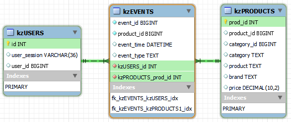

# products-recommender-system-MarkovChains
Ecommerce - Modeling a Sequential Recommendation System (SRS) of Products by Markov Chains

## **Table of Contents**:

1. Objective 
2. Origin of Markov Chains
    - Modeling a Sequential Recommendation System (SRS) of Products as a DTMC
3. Data Retrieval from Relational Database
4. Data Structuring
    - Data structuring for Unsupervised Learning (ie. KMeans or PCA)
    - Data structuring for Apriori Model application
    - Data structuring for Markov Chain Model application
4. Counting of Product Pairs for Markov Chain Model
5. Transition Matrix (Frequencies & Probabilities)
6. Making Predictions with Markov Chains Transition Matrix 
6. Conclusion
    - Limitations and Recommendations for future research directions
7. Further Discussion 
    - Modeling a Sequential Recommendation System (SRS) of Products with DTMC as Long Term Analysis with Steady State Transition Matrix
8. References

### **Objective:**

Using **`time series Markov chains`** to model and predict system dynamics over time and provide operations decisions/policy for marketing 
With sample of **`~1.2m customer purchase paths`** over a **`2-months period`**, and would like to analyze the data to help inform a new **`cross-sell sales strategy`**. 

Goal is to explore the data and build a **Simple Markov Chains model** to **predict** which product an existing customer is **most likely to purchase next**.
 
1.	Collect sample data containing customer-level **purchase paths**
2.	Calculate a **frequency** and **probability matrix** for popular products
3.	For any **given product**, **predict** the **most likely future purchase**
   
### **Datasets:**

Initial dataset files with total file size [14.7 GB] from [Kaggle's eCommerce behavior data from multi category store](https://www.kaggle.com/datasets/mkechinov/ecommerce-behavior-data-from-multi-category-store)
:
- `"2019-Oct.csv"` [5.7GB]
- `"2019-Nov.csv"` [9.7GB]

`Property & Description`

- `event_time` = Time when event happened at (in UTC).
- `event_type` = 'purchase' - a user purchased a product (other 'view' & 'cart' are filtered out for this project)
- `product_id` = ID of a product
- `category_id` = Product's category ID
- `category_code` = Product's category taxonomy (code name)
- `brand` = Downcased string of brand name. Can be missed.
- `price` = Float price of a product. Present.
- `user_id` = Permanent user ID.
- `user_session` = Temporary user's session ID. Same for each user's session. Is changed every time user come back to online store from a long pause.

### **Data Normalization:**
1. Perform Data Cleaning, Data Enrichment, and Data Aggregation on an ecommerce large dataset. 
2. Reduce datasets combined file size by utilize Database Model based on Relational Database (in `.sqlite`) by Database Normalization between 3 tables with SQLite and perform queries on the Database with INNER JOIN between tables.

- **`Data Model`** built with **`PRIMARY KEY / FOREIGN KEY (fk)`** relationships​

And each TABLE are linked up with **`'PRIMARY KEY/FOREIGN KEY'`** in Relational Database, created under one final `.sqlite` format. 

Accessible for stakeholders or collaborators with (i.e data engineer/data scientist/business analyst), to make SQL Query to access to the database, to derive useful information with Data Mining, or conduct Advanced Statistical Modeling and Machine Learning.

With **`-73%`** file size reduction from initial [14.7 GB]
- Database file (.sqlite): `db_connection_kz_ecommerce_2019-Oct-Nov.sqlite `- [3.9 GB]

## **Origin of Markov Chains**

*Markov chains were first introduced in 1906 by Andrey Markov, with the goal of showing that the Law of Large Numbers does not necessarily require the random variables to be independent.*

To see where the Markov model comes from, consider first an i.i.d. sequence of random variables $X_{0}, X_{1}, X_{2}, . . . , X_{n}$, . . . where we think of n as time. Independence is a very strong assumption: it means that the Xj’s provide no information about each other. At the other extreme, allowing general interactions between the $X_{j}
’s$ makes it very difficult to compute even basic things. Markov chains are a happy medium between complete independence and complete dependence.

**Stochastic Processes**

Stochastic process – a collection of random variables to represent the evolution of some system of random values over time. 

Define as $\{ {X_{n}, n \ge 0} \}$ or $\{ X_{0}, X_{1}, X_{2}, ... \}$ which can include a finite or infinite number of observations.

The space on which a Markov process "lives" can be either discrete or continuous, and time can be either discrete or continuous.

**Discrete Time Markov Chains (`DTMCs`)**

DTMC – is a special stochastic process satisfying "Markov/memoryless" (given previous state, the future is independent of the past) & "time-invariant", meaning the behavior (its response to inputs) does not change with time.

**Markov Property:**

Mathematically, for a stochastic process $\{ {X_{n}, n \ge 0} \}$ with state space S for any ${i, j, i_{0}, i_{1}, i_{2}, ··· \in S}$, we have 

$$Pr\{X_{n+1} = j|X_{n} = i, X_{n-1} = i_{0}, X_{n-2} = i_{1}, ···\}$$

1. **Markov property/Memoryless**
= $$Pr\{X_{n+1} = j|X_{n} = i\}$$

2. **Time invariant**
= $$Pr\{X_{m+1} = j|X_{m} = i\}$$ 
 
3. **Transition Probability**= 
$$P_{ij}$$

Define $P = [P_{ij}]$ as the transition probability matrix

This says that given the history: 
$$X_{0}, X_{1}, X_{2},...,X_{n}$$
Only the most recent term, 
$$X_{n}$$
matters for predicting 
$$X_{n+1}$$

If we think of time n as the present, times before n as the past, and times after n as the future, the Markov property says that given the present, the past and future are conditionally independent.*

*The Markov assumption greatly simplifies computations of conditional probability: instead of having to condition on the entire past, we only need to condition on the most recent value.*

reference: [Markov Chains](https://projects.iq.harvard.edu/files/stat110/files/markov_chains_handout.pdf)

### **Modeling a Sequential Recommendation System (SRS) of Products as a `DTMC`**

In an e-commerce product recommendation system, a Markov chain can be used to model the sequence of products purchased by a customer. 

The states in the Markov chain represent the products, and the transition probabilities represent the likelihood of a customer moving from one product to another. 

Hence, the product a user choose to purchase on each 'user_session' can be modeled as a Markov Chains with Transition Matrix

**DTMC as Transient Analysis with Transition Matrix**

Question that could be answered by Markov Chains model with DTMC applied as Transient Analysis with Transition Matrix for all 'product_id' product purchase sequence for all 'user_session' as states transition:

- What are the produdct a user most likely to puchase next after a purchased a current product?

## **Conclusion:** 

The solution by modeling a Products Recommender System with Markov Chain could capture sequential patterns and temporal dependencies (different points in time) of a customer's products purchased in sequence. 

This solution allowed seemingly random products purchased in sequence could potentially be opportunity for cross-selling strategy to be applied in products offerings innovation and marketing operations improvement. 
  
### **Limitations and Recommendations for future research directions:**

1. The Simple Markov Chains model used doesn’t consider user-specific preferences or semantic information (contents-based) about the products purchased. 

2. The transition matrix may not account for changes in customer behavior over time or the introduction of new products, and its only sampled between 2019-Oct ~ Nov, therefore, it’s crucial to regularly update the transition probability matrix with new data to ensure its accuracy and relevance.

3. Since there are many zero probabilities between certain product pairs, it might indicate sparse data, which could make predictions less reliable. In such cases, techniques like adding a small constant to all probabilities (smoothing) or more complex methods like matrix factorization might be used to handle the sparsity more effectively.

4. Include Action Set (A) which is the set of all possible actions that can be performed by the use, that could include "viewing" a product, adding a product to the "cart", or making a "purchase". 

5. Improve performance with performance metrics that can be used to evaluate and compare the performance of models in recommender systems, examples metrics are Precision, Recall, F1-score, MAP (Mean Average Precision), Normalized Discounted Cumulative Gain (NDCG).

## **Futher Discussion:**

### **Modeling a Sequential Recommendation System (SRS) of Products with DTMC as Long Term Analysis with Steady State Transition Matrix**

The steady-state probabilities then represent the long-term likelihood of each product being purchased, hence, the question that could be answered by Markov Chains model with DTMC applied as Long Term Analysis with Steady State Transition Matrix:

- What is the customer lifetime value (CLV) which is total revenue a ecommerce business can reasonably expect from a single customer account throughout the business relationship?

To compute the **`steady-state probabilities`** by finding the **`eigenvector`** of the **transition matrix** that corresponds to an **`eigenvalue of 1`**. This can be useful in `predicting long-term trends` or `behaviors` in the `system`. 

This **`eigenvector`** gives us the **`steady-state probabilities`**

However, **`not all Markov chains have a steady state`**.

For instance, if there are **`transient states`** (states that once left cannot be returned to), or if there are **`periodic states`** (states where the chain can return only **`after a fixed number of steps`**), then a steady state may not exist. In such cases, a steady-state analysis would not be meaningful.

- Theorem 1: A finite-state irreducible aperiodic DTMC has a unique $\pi$ (limiting distribution).
- Theorem 2: If a DTMC is both positive recurrent and aperiodic, then it is ergodic. Ergodicity guarantees the existence of $\pi$.

A Markov chain can be ergodic, if it is possible to go from `any state to every other state` in `finitely many moves`

**What if the chain doesn’t reach a steady-state?**

1. Only regular Markov chains converge over time. 
    - It is considered regular if `some power` of the `transition matrix` has `only positive`, `non-zero, values`
2. And if Markov Chain does not converge, it has a `periodic pattern`.
    - will get the same transition probabilities from time to time.
3. Test if Markov chain will eventually converge.
    - For any *`n x n`* transition matrix, could check if `all powers` of the `transition matrix` have all positive, non-zero, values, up to power: $\max_{power} = (n - 1)^{2} + 1$

reference: 
[Markov Models and Cost Effectiveness Analysis Applications in Medical Research, Springer](https://link.springer.com/chapter/10.1007/978-3-319-43742-2_24)

## **References:**

1. Steffen Rendle, Christoph Freudenthaler, and Lars Schmidt-Thieme. 2010. "**Factorizing personalized Markov chains for next-basket recommendation**". In Proceedings of the 19th international conference on World wide web (WWW '10). Association for Computing Machinery, New York, NY, USA, 811–820. https://doi.org/10.1145/1772690.1772773 

2. Y. Yang, H. -J. Jang and B. Kim, "**A Hybrid Recommender System for Sequential Recommendation: Combining Similarity Models With Markov Chains**" in IEEE Access, vol. 8, pp. 190136-190146 (2020), https://doi.org/10.1109/ACCESS.2020.3027380  

3. Lonjarret, C., Auburtin, R., Robardet, C. et al. "**Sequential recommendation with metric models based on frequent sequences**". Data Min Knowl Disc 35, 1087–1133 (2021). https://doi.org/10.1007/s10618-021-00744-w 

4. Chen G, Li Z. "**A New Method Combining Pattern Prediction and Preference Prediction for Next Basket Recommendation**" Entropy (Basel); 23(11):1430. (2021) https://doi.org/10.3390/e23111430 

5. Chen, Xin, Alex Reibman, and Sanjay Arora. "**Sequential Recommendation Model for Next Purchase Prediction**" arXiv preprint arXiv:2207.06225 (2022). https://doi.org/10.48550/arXiv.2207.06225 

